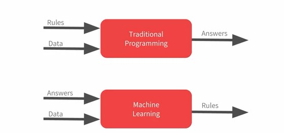
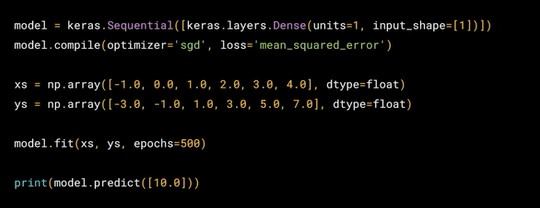

## Week 1 - A new programming paradigm

### A primer to machine learning

- Unlike traditional programming paradigm which takes rules and data to provide us with answers, **Machine Learning** utilizes answers and data to provide us with rules.
- This is particularly helpful where humans cannot define explicit rules due to the high variance or dynamism in the data.
- So the machine ingests a lot of labelled examples and determines the rules itself, by figuring out the specific patterns in each set of data and determining what makes them distinct.

---

### Hello World of Neural Networks

- Tensorflow makes it easy to code Neural Networks as most of the difficult mathematics related stuff are abstracted in built-in functions.
- Keras is a deep-learning library which is built into newer TensorFlow versions. It helps us define models, optimizers and loss functions in few lines of code.
- **Basic workflow :**
  - Model takes examples of data for training.
  - Model assumes an initial equation and tries to fit the data. (Initializer)
  - Loss function determines how close the predicted data is to the actual data
  - Optimizers are functions which guess the next equation possibility from the previous outcomes.
  - The objective is to minimize the loss, and as the accuracy reaches 100%, the neural network is said to be reaching convergence.

