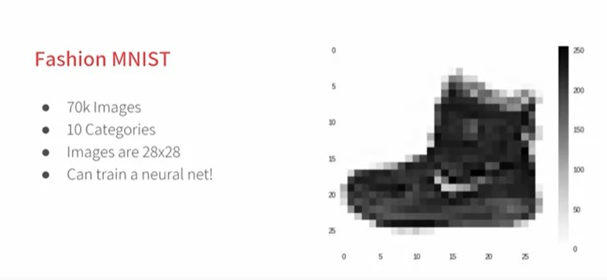
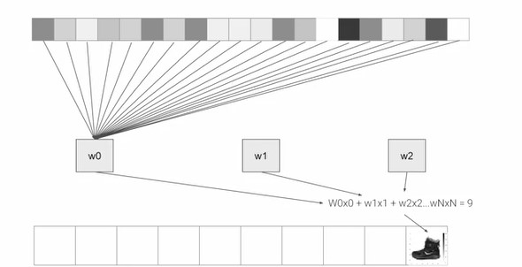
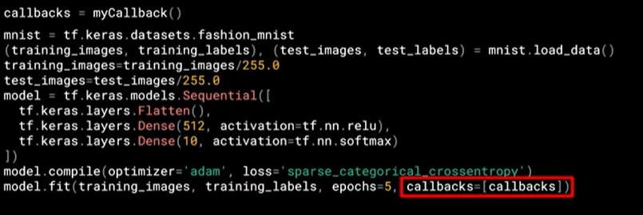

## Week 2 - Introduction to Computer Vision

### An Introduction to Computer Vision

- Computer vision is a field in Computer Science which basically is having a computer understand and label what is present in an image.
- The dataset used here is the Fashion MNIST which has 70k images in 10 different categories, of the size 28x28.
- The images are sufficient enough that the neural network can distinguish the features but gets results faster due to the smaller size of the images.
- The images are also grayscale so that each pixel can be represented in a value of 0-255 i.e 1 byte per pixel therefore the entire image is 784 bytes in size.



---

### Writing code to load training data

**Code**

```py
fashion_mnist = keras.datasets.fashion_mnist
(train_img,train_labels),(test_img,test_labels)=fashion_mnist.load_data()
```

**Purpose**

- When building a neural network, it is important that the network can identify images outside of the images it was trained on. This is done in order to avoid overfitting the data to the training data set.
- The test data is a similar data set which lets us see how good the neural network has been trained.
- Train Images: 60,000
- Test Images: 10,000
- Each image is labelled with a number due to the following reasons:
  - Machines are better at understanding numbers
  - Reduces bias towards any particular language

### Coding a Computer Vision Neural Network

**Code**

```py
# normalise the data here by dividing with 255.0
model = keras.Sequential([
    keras.layers.Flatten(input_shape=(28,28)),
    keras.layers.Dense(128,activation=tf.nn.relu),
    keras.layers.Dense(10,activation=tf.nn.softmax)
])
```

**Purpose**

- **Flatten Layer:** The images are in the size 28x28. The flatten layer takes these images and turns it into a simple linear array.
- **Hidden Layer:** The hidden layer here consists of 128 neurons. Each neuron takes the 784 values and associates a particular weight to it.
  
- **Softmax Layer:** The last layer consists of 10 classes into which the image is classified into.

- Note: For color images, more hidden layers can be often necessary.

### Using Callbacks to control training

- Callback functions can be used to control the number of epochs to the bare minimum by specifying a metric which can be used to cancel the training at that point.

```py
class myCallback(tf.keras.callbacks.Callback):
    def on_epoch_end(self,epoch,logs={}):
        if (logs.get('loss')<0.4):
            print("\nLoss target, cancelling training!")
            self.model.stop_training=True
```


