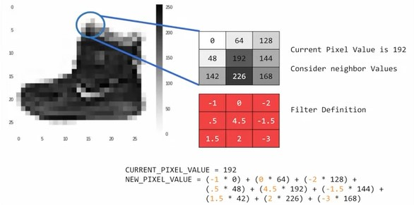
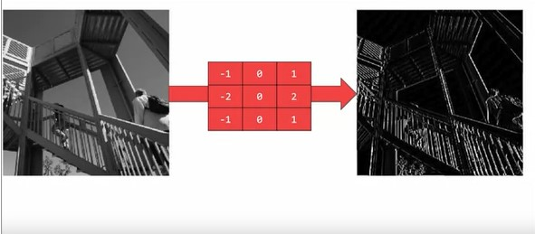
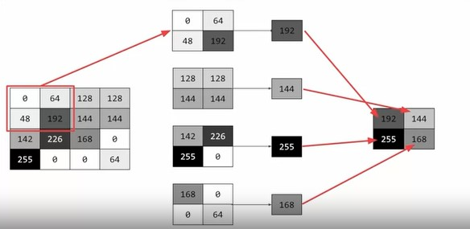
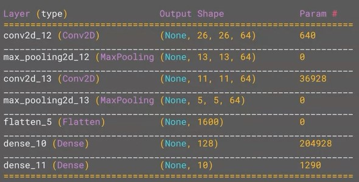

## Week 3 - Enhancing Vision with Convolutional Neural Networks

In the previous sections, we were using deep neural networks for working with images, which look at the image pixel-by-pixel. CNNs work differently as they are similar to applying a filter to an image which can spot features by the grouping or proximity of the pixels.

### What are convolutions and pooling?

- From the aforementioned description, we can say that the primary objective of the convolution process is to condense the details of the image down to the most important features.
- Most image processing tasks might involve passing a filter over an image to change the pixel values of the underlying image.
- **Convolution**can be visualised as a filter which takes the neighbouring pixels into consideration. If our filter is 3x3 then we can look at the neigbouring pixels and multiply the value with the the corresponding filter value to get the new pixel value.



- Some convolutions can change the image in such a way that certain features of the image can be emphasized. For reference, the image below uses a filter which emphasizes vertical lines in the photo.



- **Pooling** is a process of compressing the images which is used alongside the convolution process. It goes through the image in a fixed number of pixels per time and chooses the highest number of pixel in that frame. This process continues till the whole image is compressed.



---

### Implementing Convolutional Layers and Pooling Layers

**Code**

```py
model=tf.keras.Sequential([
  tf.keras.layers.Conv2D(64,(3,3),activation="relu",input_shape=(28,28,1)),
  tf.keras.layers.MaxPooling2D(2,2),
  tf.keras.layers.Conv2D(64,(3,3),activation="relu"),
  tf.keras.layers.MaxPooling2D(2,2),
  # Regular NN
  tf.keras.layers.Flatten(),
  tf.keras.layers.Dense(128,activation="relu"),
  tf.keras.layers.Dense(10,activation="softmax")
])
```

**Purpose**

- Conv2D layer applies 64 filters in a 3x3 grid and activated through ReLU, and the input shape is 28x28 with the color depth of 1 as the images are grayscale. The output here is 26x26 as the 3x3 grid requires the neighbouring pixels to be present, which leads to the elimination of the marginal pixels.
- MaxPooling takes the maximum value from a 2x2 pool
- The process is repeated so that the network can learn another set of convolutions on top of the existing one, reducing the size of images to 5x5, but there are 64 different convolutiuons which results in a 25 \* 64 = 1600 values.
- By the time the image reaches the Flatten Layer, it's way more condensed and the content is greatly simplified. The convolutions will filter it to the features which determine the ouput.


