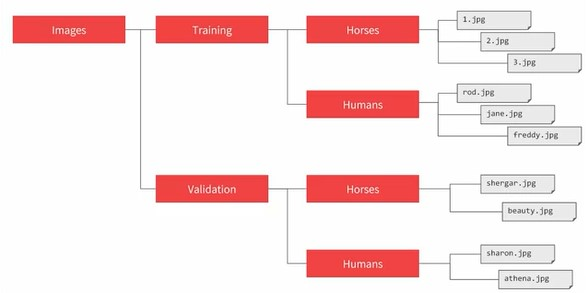

## Week 4 - Using Real-world images

### Understanding Image Generator

- In the previous sections, we used uniform images which were staged and framed in a area of 28x28.
- Larger images in real-world scenarios may contain images which ahve features present in different areas of the image. Some images can contain multiple subjects in them.
- The Fashion MNIST and the MNIST datasets were inbuilt and were handily split into the training and test sets along with proper labelling. This is not the case in the real-world.
- That's where the image generator API from tensorflow comes into picture. The image generator API can traverse directories and subdirectories to find images and automatically generate labels with their respective filenames.
  

**Code**

```py
from tensorflow.keras.preprocessing.image
import ImageDataGenerator

train_datagen=ImageDataGenerator(rescale=1./255)
train_generator=train_datagen.flow_from_directory(
    train_dir,
    target_size=(300,300),
    batch_size=128,
    class_mode='binary')

test_datagen=ImageDataGenerator(rescale=1./255)
test_generator=test_datagen.flow_from_directory(
    train_dir,
    target_size=(300,300),
    batch_size=32,
    class_mode='binary')
```

### Defining a ConvNet to use complex images

**Code**

```py
model=tf.keras.Sequential([
  tf.keras.layers.Conv2D(16,(3,3),activation="relu",input_shape=(300,300,3)),
  tf.keras.layers.MaxPooling2D(2,2),
  tf.keras.layers.Conv2D(32,(3,3),activation="relu"),
  tf.keras.layers.MaxPooling2D(2,2),
  tf.keras.layers.Conv2D(64,(3,3),activation="relu"),
  tf.keras.layers.MaxPooling2D(2,2),
  # Regular NN
  tf.keras.layers.Flatten(),
  tf.keras.layers.Dense(512,activation="relu"),
  tf.keras.layers.Dense(1,activation="sigmoid")
])
```

**Purpose**

- The more number of Conv and Pooling layers are due to the complex nature and the increased size of the image. In the previous MNIST arch, we were starting out at 28x28 and reducing it to 5x5 after 2 Conv+Pool layers. Here, we reduce a 300x300 image into 35x35 by using 3 Conv+Pool layers.
- The input shape is also changed to contain the 3-bit color depth.
- The output layer is changed to a binary classifier for using the Sigmoid activation function where one class tends more towards 0 and the other class tends more towards 1.
- Without convolution, the size of the images after the Flatten layer would have been greater than 900,000, but with Conv the size is reduced to 78,400.

### Training the ConvNet with fit_generator

**Code**

```py
from tensorflow.keras.optimizers import RMSProp
model.compile(loss='binary_crossentropy',optimizer=RMSprop(lr=0.001),metrics=['acc'])
history=model.fit_generator(
    train_generator,
    steps_per_epoch=8,
    epochs=15,
    validation_data=validation_generator,
    validation_steps=8,
    verbose=2)
```

**Purpose**

- Binary Crossentropy as the loss function instead of the Categorical Crossentropy as we have only two classes here.
- RMSProp as the optimizer instead of Adam which helps you adjust the learning rate to experiment with performance.
- Instead of model.fit, we use model.fit_generator.
  - The first parameter, train_generator is the generator object that we made before. This streams the images in the batch_size of 128 as we mentioned.
  - The steps_per_epoch is basically (total no.of images / batch_size).
  - Similarly we can add the validation data also.
