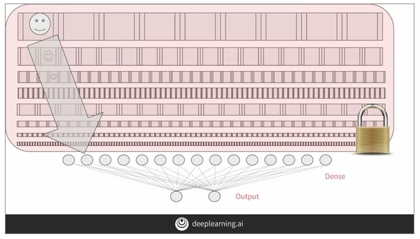
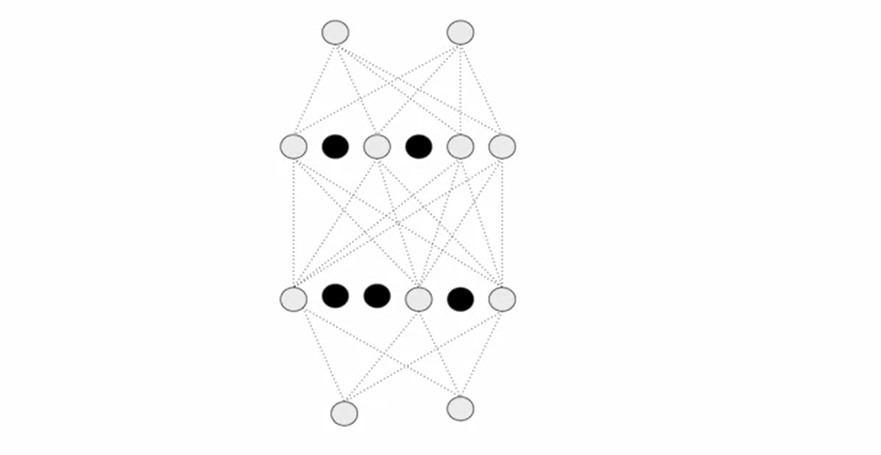
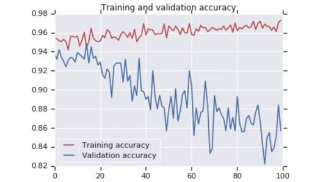
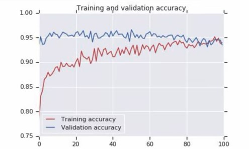

## Week 3 - Transfer Learning

- Transfer Learning is one of the most important techniques of deep learning and TensorFlow makes it easier to introduce pre-trained models with a few lines of code to bootstrap your CNN.
- These models are effective as they are open-source models trained on millions of images over weeks of time, and we can use the parameters easily enabling us to perform deep learning tasks even on smaller datasets.

### Understanding transfer learning : the concepts

- The concept of transfer learning is to use existing models trained on far more data and utilizing the features learnt by them.
- This leads to a far more sophiscated model with more features learnt already. These layers can be frozen to utilise these convolutions to identify the best features from your dataset.
- The most effective method would be just joining your DNN onto the Convolutions transfered from the pre-trained model. Some lower layers can be retrained to fit specific cases but that is a matter of trial and error.



---

### Coding transfer learning from the inception mode

[Pretrained Weights](https://storage.googleapis.com/mledu-datasets/inception_v3_weights_tf_dim_ordering_tf_kernels_notop.h5)

**Code**

```py
import os
from tensorflow.keras import layers
from tensorflow.keras import Model
from tensorflow.keras.applications.inception_v3 import InceptionV3
from tensorflow.keras.optimizers import RMSProp
local_weights_file='/tmp/inception_v3_weights_tf_dim_ordering_tf_kernels_notop.h5'
pre_trained_model=InceptionV3(input_shape=(150,150,3),include_top=False,weights=None)
pre_trained_model.load_weights(local_weights_file)

# Freezing the layers
for layer in pre_trained_model.layers:
    layer.trainable=False

pre_trained_model.summary()
```

---

### Coding your own model with transferred features

```py
last_layer  = pre_trained_model.get_layer('mixed7') # 7x7 output from Inception
last_output = last_layer.output

x = layers.Flatten()(last_output)
x = layers.Dense(1024,activation='relu')(x)
x = layers.Dense(1,activation='sigmoid')(x)

model = Model(pre_trained_model.input,x)
model.compile(optimizer=RMSProp(lr=0.0001),loss='binary_crossentropy',metrics=['acc'])
```

- The training and validation accuracy graph from the above code shows that the network overfits after some epochs and the validation accuracy lowers massively.
- To avoid this, we will try Dropouts.

---

### Exploring Dropouts

- Dropouts remove a random number of neurons from your neural network. This is effective due to :

  - Neighboring neurons can often end up with similar weights leading to overfitting
  - A specific neuron can over-weigh the input from a neuron in the previous layer thereby, overspecializing a result.

  

- The graph below show the difference before and after dropout

  
  

**Code**

```py
x = layers.Flatten()(last_output)
x = layers.Dense(1024,activation='relu')(x)
x = layers.Dropout(0.2)(x) # Dropping out 20 percent of neurons
x = layers.Dense(1,activation='sigmoid')(x)
```
