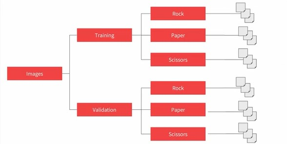
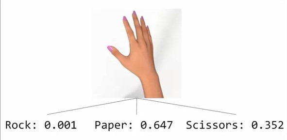

## Week 4 - Multiclass Classification

- This multiclass classification is built on the Rock,Paper,Scissons Dataset
- Rock Paper Scissors is a dataset containing 2,892 images of diverse hands in Rock/Paper/Scissors poses. It is licensed CC By 2.0 and available for all purposes, but it’s intent is primarily for learning and research.(300x300 images in 24-bit color with around 3000 images)
  [Training Set](https://storage.googleapis.com/laurencemoroney-blog.appspot.com/rps.zip)
  [Test Set](https://storage.googleapis.com/laurencemoroney-blog.appspot.com/rps-test-set.zip)
- The folder structure for the ImageDataGenerator is given below:
  

### Going from binary to multiclass

**Reading the images**

```py
train_datagen=ImageDataGenerator(rescale=1./255)
train_generator=train_datagen.flow_from_directory(
    train_dir,target_size=(300,300),batch_size=128,class_mode='categorical')
```

**Model Layers and Compilation**

```py
# Output layer
tf.keras.layers.Dense(3,activation='softmax')

# Model Compilation
model.compile(loss='categorical_crossentropy', optimizer=RMSProp(lr=0.001),
              metrics=['accuracy'])
```


